# SocietyManagementSystem
The Society Management System is a web-based application designed to streamline the management tasks of residential societies or communities. This system aims to simplify the process of managing various aspects such as member information, facility bookings, complaint resolution, and financial transactions within a society.

### Working Links for the Project
Web Application hosted on Azure -> [Society Management System](http://4.213.165.186/SOCIETY/login.html)

Github Repository -> https://github.com/RupeshHaryan/SocietyManagementHub.git

Project Documentation With Project Video-> [Guide](https://drive.google.com/drive/folders/1bEzVooDVzjU0fKH44YzOkTWEw2-7aejz)

# Project Aim

A society management system project aims to revolutionize the administrative processes and communication channels within residential communities. 
By integrating features such as user management, facility booking, maintenance requests, and payment systems, 
the platform seeks to streamline operations and enhance resident satisfaction. 
From managing announcements and visitor registration to handling complaints and organizing events, the system provides a comprehensive solution for community governance. 
With a focus on security, accessibility, and data privacy, it ensures the smooth functioning of residential complexes while fostering a sense of belonging and community engagement. 
Through continuous feedback mechanisms and customizable features, the system adapts to the evolving needs of residents and committee members, 
promoting efficient management practices and fostering harmonious living environments.

# Azure Services Used

1.Azure app service (To create and host the website online) 
2.Azure SQL Database Sevice (To Store the data into an SQL database) 
3.Azure AI Service (An ai service(chatbot) integrated into the website) 
4.Azure BackUp Service (To create a Backup of our Web App) 
5.Azure Storage service(To store backup files) 

# Web Tecnologies Used

1.HTML 
2.CSS 
3.PHP 
4.MySQl 

# Resource Visualizer

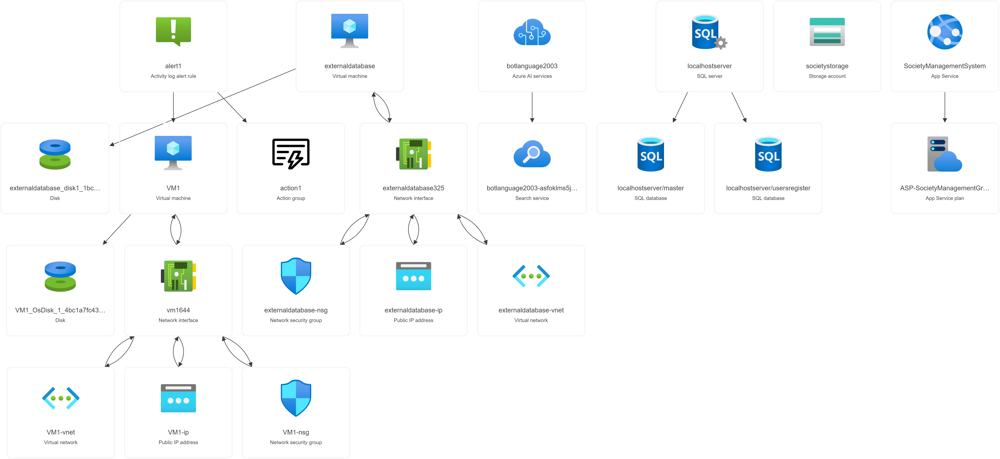

# Azure Resources Overview

## App Service:
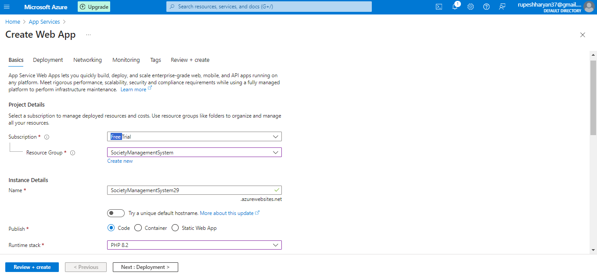

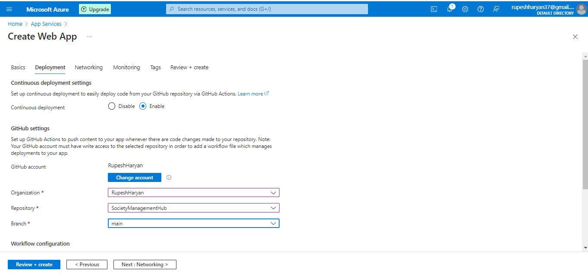

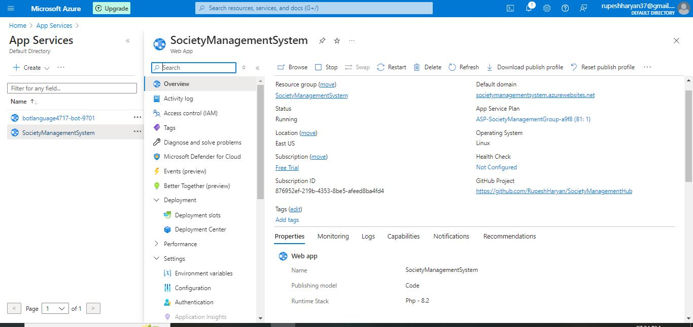

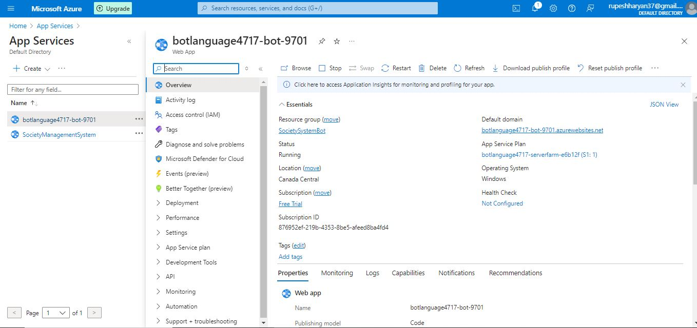

## Database:
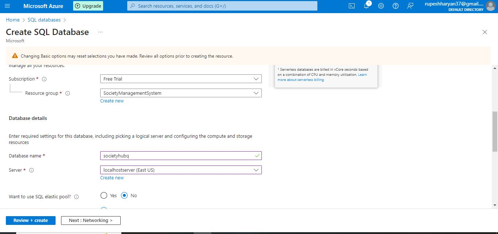
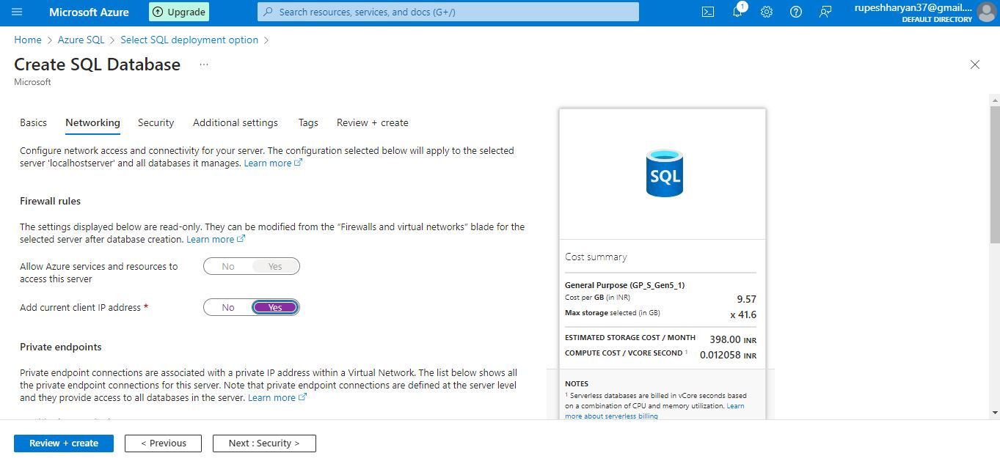
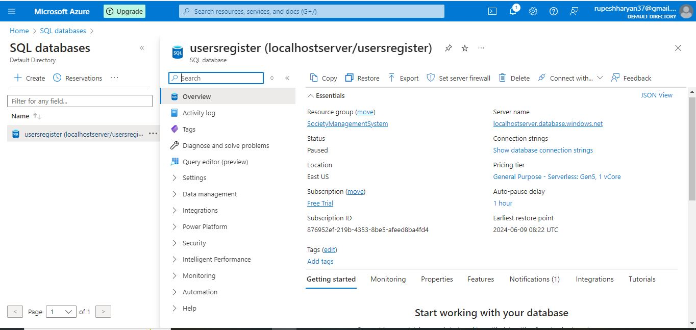
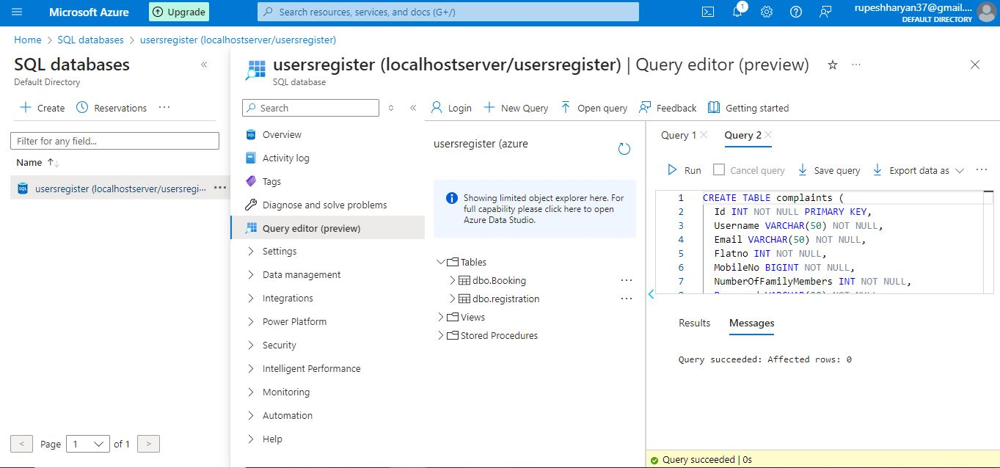

## Azure AI Service:
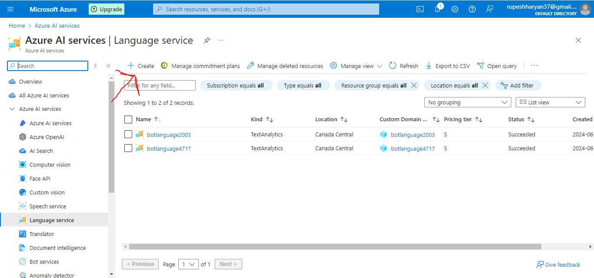
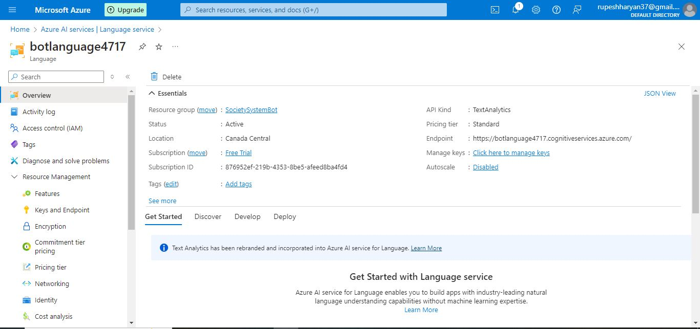
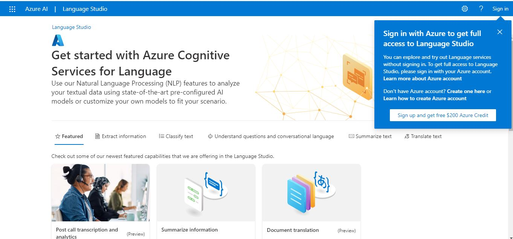
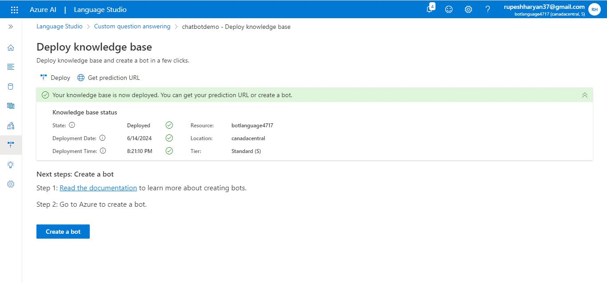
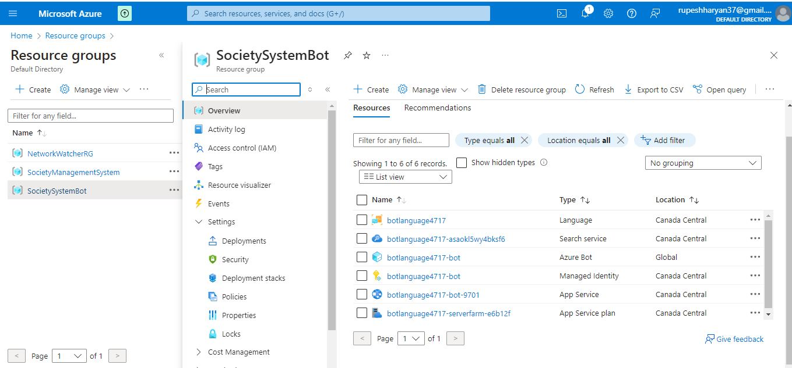

## Azure Backup:

## Azure Storage:

# WebSite Preview

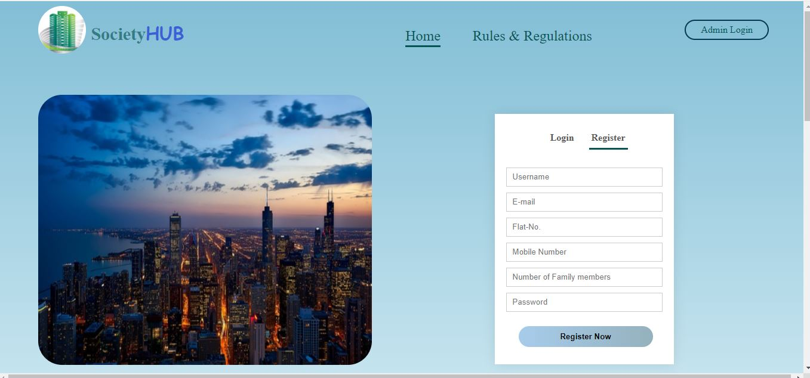

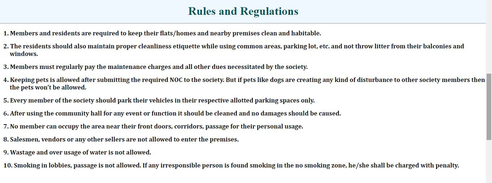

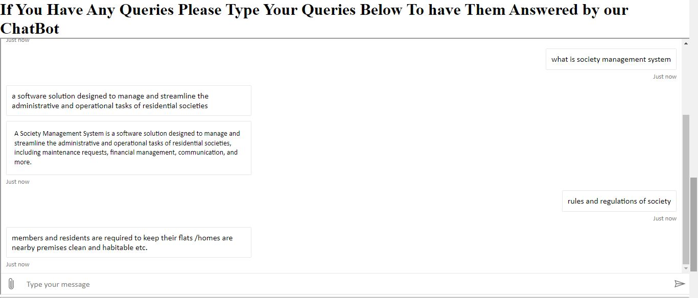

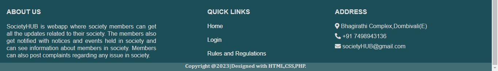

This is the Society Management System Project created for internship purposes. 
